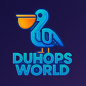

# 🚀 DuhOps World - DevOps Portfolio & Knowledge Hub

A modern, feature-rich portfolio website built with Next.js 14, showcasing DevOps expertise, automation tools, and educational content.



## 🌟 Live Website

**[https://www.duhops.world](https://www.duhops.world)**

## ✨ Features

### 🎨 Modern Design
- **Dark mode** by default with theme toggle support
- **Responsive design** - Mobile, tablet, and desktop optimized
- **Animated particles background** for engaging UI
- **Gradient accents** with navy blue, purple, and deep blue themes
- **Custom branding** with DuhOps World logo and favicon

### 📱 Core Sections

#### 🏠 Home
- Hero section with call-to-action buttons
- Skills overview cards (AWS, Kubernetes, CI/CD)
- Featured projects showcase
- Responsive grid layouts

#### 👤 About
- Professional summary
- Core expertise sections (AWS, DevOps practices)
- Education & certifications
- **Profile photo** integration
- **Resume link** to Google Docs published version

#### 💼 Experience
- Detailed work history
- Project highlights
- Technical achievements

#### 🗂️ Portfolio
- Project case studies
- Technology stack details
- Implementation highlights

#### 📝 Blog
- Articles on DevOps, AWS, Kubernetes, and Terraform
- Category-based organization
- Reading time estimates
- Featured posts with images

#### 🎥 Videos
- **Full tutorials section** - 4 in-depth videos:
  - Gemini CLI
  - AWS Architect AI
  - NotebookLM Deep Dive
  - Host n8n using Cloudflare
- **YouTube Shorts section** - 10 quick tips (bite-sized content)
- Embedded video players
- Direct YouTube channel integration
- Subscribe button: [@duhops](https://www.youtube.com/@duhops)

#### 📥 Downloads
- **AI Product Architect Prompt** - Complete prompt for product requirements and AI-assisted development
- **n8n Workflow Collection** - 500+ automation templates repository
  - Categories: AI, Communication, Data, Content, Business Operations
  - Direct GitHub repository link: [n8n-workflow-duhops-world](https://github.com/sandeep27choudhary/n8n-workflow-duhops-world)
- Free downloadable resources
- Preview sections for each resource

#### 📧 Contact
- Contact form
- Social media links
- Professional networking

### 🎯 Special Features

#### 🔔 YouTube Subscription Popup
- **Auto-appears** 3 seconds after page load
- **Custom Font Awesome YouTube icon**
- **Navy blue, purple, and deep blue** gradient background
- **Red subscribe button** for maximum visibility
- Translucent backdrop with blur effect
- Mobile-responsive design
- Direct subscription link: [@duhops](https://www.youtube.com/@duhops?sub_confirmation=1)

#### 🔗 Navigation
- Fixed navbar with scroll effects
- Logo + branding in navbar
- Theme toggle integration
- Mobile hamburger menu
- External link to [news.duhops.world](https://news.duhops.world)

#### 🦶 Footer
- Quick links to all sections
- **Social media connections:**
  - GitHub: [@sandeep27choudhary](https://github.com/sandeep27choudhary)
  - LinkedIn: [sandeep-k-choudhary](https://www.linkedin.com/in/sandeep-k-choudhary)
- Copyright information
- DuhOps World branding

## 🛠️ Tech Stack

### Frontend
- **Framework:** Next.js 14 (App Router)
- **Language:** TypeScript
- **Styling:** Tailwind CSS
- **UI Components:** shadcn/ui
- **Icons:** Lucide React + Custom SVG
- **Animations:** Framer Motion (particles)

### Design System
- **Color Scheme:** Navy blue, purple, deep blue, red accents
- **Typography:** Inter font family
- **Components:** Modular and reusable
- **Responsive:** Mobile-first approach

### External Integrations
- **Image API:** Pexels (for blog images)
- **YouTube:** Embedded videos and shorts
- **GitHub:** Repository links and downloads

## 📂 Project Structure

```
devops-portfolio/
├── app/
│   ├── about/              # About page
│   ├── blog/              # Blog posts
│   │   └── videos/        # Video tutorials page
│   ├── contact/           # Contact form
│   ├── downloads/         # Downloadable resources
│   ├── experience/        # Work experience
│   ├── portfolio/         # Project showcase
│   ├── layout.tsx         # Root layout with providers
│   ├── page.tsx           # Home page
│   └── globals.css        # Global styles
├── components/
│   ├── ui/                # shadcn/ui components
│   ├── footer.tsx         # Footer component
│   ├── navbar.tsx         # Navigation bar
│   ├── particles-background.tsx
│   ├── theme-provider.tsx
│   ├── theme-toggle.tsx
│   └── youtube-popup.tsx  # Subscription popup
├── lib/
│   ├── pexels.ts         # Pexels API integration
│   └── utils.ts          # Utility functions
├── public/
│   ├── duhops-logo.jpg   # Website logo
│   └── profile-photo.jpeg # Profile picture
└── styles/
    └── globals.css       # Additional styles
```

## 🚀 Getting Started

### Prerequisites
- Node.js 18+ 
- npm or yarn

### Installation

1. **Clone the repository**
```bash
git clone https://github.com/sandeep27choudhary/devops-portfolio.git
cd devops-portfolio
```

2. **Install dependencies**
```bash
npm install
# or
yarn install
```

3. **Run development server**
```bash
npm run dev
# or
yarn dev
```

4. **Open in browser**
```
http://localhost:3000
```

### Build for Production

```bash
npm run build
npm start
```

## 🌐 Deployment

This project is deployed on Vercel. Any push to the `main` branch triggers automatic deployment.

**Live URL:** [https://www.duhops.world](https://www.duhops.world)

## 📊 Content Strategy

### Video Content
- **Full Tutorials:** In-depth guides on DevOps tools and practices
- **YouTube Shorts:** Quick tips under 60 seconds
- **Regular uploads:** Subscribe for the latest content

### Downloadable Resources
- **AI Prompts:** Ready-to-use prompts for AI-assisted development
- **Automation Templates:** 500+ n8n workflow templates
- **Free access:** All resources available at no cost

### Blog Articles
- DevOps best practices
- AWS architecture patterns
- Kubernetes deployment strategies
- Terraform infrastructure guides
- CI/CD optimization techniques

## 🎯 Key Highlights

- ✅ **Modern Next.js 14** with App Router
- ✅ **TypeScript** for type safety
- ✅ **Responsive design** across all devices
- ✅ **Dark mode** with elegant UI
- ✅ **SEO optimized** with metadata
- ✅ **Fast performance** with optimized images
- ✅ **Accessible** with semantic HTML
- ✅ **Professional branding** with custom logo
- ✅ **YouTube integration** with embedded videos
- ✅ **Download resources** for community
- ✅ **Social media connected** (GitHub, LinkedIn, YouTube)

## 📝 License

This project is built for personal portfolio use. Feel free to use it as inspiration for your own portfolio!

## 👨‍💻 Author

**Sandeep Choudhary**
- Cloud Infrastructure & DevOps Engineer
- Website: [duhops.world](https://www.duhops.world)
- GitHub: [@sandeep27choudhary](https://github.com/sandeep27choudhary)
- LinkedIn: [sandeep-k-choudhary](https://www.linkedin.com/in/sandeep-k-choudhary)
- YouTube: [@duhops](https://www.youtube.com/@duhops)

## 🙏 Acknowledgments

- **Next.js** team for the amazing framework
- **Vercel** for seamless deployment
- **shadcn/ui** for beautiful components
- **Lucide** for icon library
- **Font Awesome** for custom YouTube icon
- DevOps community for continuous inspiration

---

**Built with ❤️ and ☕ by Sandeep Choudhary**

*Empowering the DevOps community with knowledge, tools, and automation* 🚀
